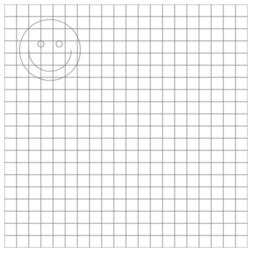

# DrawingWithJavaScript
A JS Utility to make html canvas art

## Usage 
* Download the repo as zip
* Extract the files
* Open _index.html_
* Located and edit the _draw()_ function

## Example Output
After downloading the example, you should see the something similar to this: 


To see the X,Y coordinates as you click the mouse, enable the console output. For example: 


To hide the grid, make sure to comment out the following line in _index.html_: 
```javascript
drawGrid();
```

To control the size of the grid, override the _size_ variable, either by declaring it in _index.html_ or editing _canvasDrawJs.js_. For example: 
```javascript
var size = 40;
```

To change the color of the grid, 

## More Info 
* You may darw using any canvas methods as listed at the [W3Schools Canvas Refrence](https://www.w3schools.com/graphics/canvas_reference.asp) 
